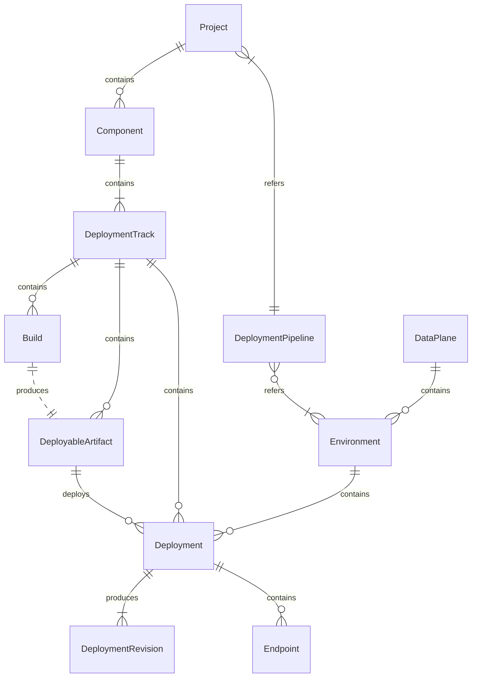

# Choreo v3 Resource Kinds

This document describes the core kinds used in Choreo CRDs, the relationships between them, and detailed information about each kind.

## Overview

- [Design Considerations](#design-considerations)
- [Resource Hierarchy](#resource-hierarchy)
- [Kubernetes Metadata Representation](#kubernetes-metadata-representation)
- [Resource Kinds](#resource-kinds)
    - [DataPlane](#dataplane)
    - [Environment](#environment)
    - [DeploymentPipeline](#deploymentpipeline)
    - [Project](#project)
    - [Component](#component)
    - [DeploymentTrack](#deploymenttrack)
    - [Build](#build)
    - [DeployableArtifact](#deployableartifact)
    - [Deployment](#deployment)
    - [DeploymentRevision](#deploymentrevision)
    - [Endpoint](#endpoint)
    - [Secret](#secret)

## Design Considerations

When designing the resource kinds for Choreo v3, several principles have been followed to ensure the consistency between resource kinds. These considerations help to keep a clear mapping of Choreo concepts to resource kinds while maintaining the simplicity of the resource model.

- Each concept in Choreo will have a corresponding resource kind. This one-to-one mapping will ensures that the users can easily understand the resource model.
- In situations where a resource kind is required but does not directly correspond to a core Choreo concept, the following will apply:
    - If two resource kinds share a one-to-one relationship, they will be combined into a single resource kind.
    - If combining them introduces implementation complexity or if it makes logical sense to keep them distinct, keep them as separate resource kinds. For example,
        - Implementation complexity: A resource kinds with many fields may cause the controller to perform many operations, leading to processing delays for that resource kind.
        - Logical sense: `Deployment` and `DeploymentRevision` are kept as separate resource kinds. For example, `Deployment` and `HorizontalPodAutoscaler` in Kubernetes.
    - For resource kinds with a one-to-many relationship, the child resources can be embedded within the parent resource kind with `<KindName>TemplateSpec` to define the specifications of the child resources to reduce the number of resource kinds.

[Back to Top](#overview)

## Resource Hierarchy

The following diagram shows the relationships between the core kinds in Choreo v3.



[Back to Top](#overview)

## Kubernetes Metadata Representation

To represent the Choreo hierarchical resource model in Kubernetes, the following rules will be followed:

1. The Organization will be represented as a Cluster-wide CRD that will mapped to a Kubernetes Namespace.
2. The resources within an organization (e.g., Components, Projects, Environments, DataPlanes) will be represented as a Namespaced resources in Kubernetes.
3. The relationships between namespaced resources will be represented using Kubernetes labels.
4. Any other metadata will be represented as annotations in the Kubernetes resources (e.g., Display Name, Description).

### Labels Based Relationships

The following labels format will be used to represent the relationships between the resources:

`core.choreo.dev/<kind-lowecase>=<resource-name>`

Examples:
- `core.choreo.dev/organization=my-org`: The organization name that the resource belongs to.
- `core.choreo.dev/project=my-project`: The project name that the resource belongs to.

In addition to the above labels, the following label will be used to represent the name of the resource:

`core.choreo.dev/name=<resource-name>`

The reason for using having additional label for the resource name is to keep the Choreo hierarchical naming without conflicting with the Kubernetes resource name.
This will allow duplicate resource names within the same namespace such as having two components with the same name in different projects.

[Back to Top](#overview)

## Resource Kinds

The following sections describe each resource kind in detail and provide information about the fields and relationships of each resource kind.

### DataPlane

The `DataPlane` resource kind represents a Private Data Plane in Choreo. The controller of this resource kind is responsible for keeping the health status of the data plane. All other resources kinds will refer to this resource
to get the data plane information.

**Field Reference:**

```yaml
apiVersion: core.choreo.dev/v1
kind: DataPlane
metadata:
  # Unique name of the data plane within the organization (namespace).
  #
  # +required
  # +immutable
  name: us-dp-1
  # Organization name that the resource belongs to.
  #
  # +immutable
  namespace: test-org
  annotations:
    # Display name of the data plane.
    #
    # +optional
    core.choreo.dev/display-name: US Data Plane
    # Description of the data plane.
    #
    # +optional
    core.choreo.dev/description: Data plane for the US region
  labels:
    # Organization name that the resource belongs to.
    #
    # +required
    # +immutable
    core.choreo.dev/organization: test-org
spec:
  kubernetesCluster:
    # Name of the kubernetes cluster
    #
    # +required
    name: choreo-dev-dataplane-aks-cluster-002
    # Reference to the connection config for the kubernetes cluster.
    # Consumers of this data plane will use this connection config to connect to the kubernetes cluster.
    #
    # +required
    connectionConfigRef: cdp-1-aks-connection-config
    # Map of feature flags that are enabled for the data plane.
    #
    # +optional
    featureFlags:
      cilium: true
      scaleToZero: true
      gatewayType: envoy
  # Configuration for the gateway that is used by the data plane.
  #
  # +required
  gateway:
    # Virtual host used by the public gateway.
    publicVirtualHost: e1-us-east-azure.preview-dv.choreoapis.dev
    # Virtual host used by the organization gateway (aka internal gateway).
    organizationVirtualHost: e1-us-east-azure.internal.preview-dv.choreoapis.dev
```

[Back to Top](#overview)

### Environment

The `Environment` resource kind represents an environment bound to a specific data plane in Choreo.
The `spec.dataPlaneRef` field should point to a existing `DataPlane` resource that the environment is associated with.

**Field Reference:**

```yaml
apiVersion: core.choreo.dev/v1
kind: Environment
metadata:
  # Unique name of the environment within the organization (namespace).
  #
  # +required
  # +immutable
  name: us-production
  # Organization name that the resource belongs to.
  #
  # +immutable
  namespace: test-org
  annotations:
    # Display name of the environment.
    #
    # +required
    # +mutable
    core.choreo.dev/display-name: Production
    # Description of the environment.
    #
    # +optional
    # +mutable
    core.choreo.dev/description: Production environment for the US region
  labels:
    # Organization name that the resource belongs to.
    #
    # +required
    # +immutable
    core.choreo.dev/organization: test-org
spec:
  # Reference to the data plane that the environment is associated with.
  # For the Shared Data Plane, the reference will use a special value with
  # format of `<region>-cdp-<number>`.
  #
  # +required
  # +immutable
  dataPlaneRef: us-cdp-1
  # Indicates if the environment is a production environment (aka Critical).
  #
  # +optional (default: false)
  # +immutable
  isProduction: true/false
  # Override the DNS prefix for the domain names used by the environment.
  # The format of the domain names will be as follows:
  # Public:`<organizationUuid>-<dnsPrefix>.<region>.<dataPlanePublicVirtualHost>`
  # Sandbox:`<organizationUuid>-<dnsPrefix>.-sandbox.<region>.<dataPlanePublicVirtualHost>`
  # Organization: `<organizationUuid>-<dnsPrefix>-internal.<region>.<dataPlaneOrganizationVirtualHost>`
  #
  #
  # If not provided, the environment name will be used as the dns prefix.
  #
  # +optional
  # +immutable
  dnsPrefix: us-production
```

[Back to Top](#overview)

### DeploymentPipeline

The `DeploymentPipeline` resource kind represents an ordered set of environments that a deployment will go through to reach a critical environment.
Each organization will have a default deployment pipelines that will be used for all deployments unless a custom deployment pipeline is specified.

**Field Reference:**

```yaml
apiVersion: core.choreo.dev/v1
kind: DeploymentPipeline
metadata:
  # Unique name of the deployment pipeline within the organization (namespace).
  #
  # +required
  # +immutable
  name: default-deployment-pipeline
  # Organization name that the resource belongs to.
  #
  # +immutable
  namespace: test-org
  annotations:
    # Display name of the deployment pipeline.
    #
    # +required
    core.choreo.dev/display-name: Default deployment pipeline
    # Description of the deployment pipeline.
    #
    # +optional
    core.choreo.dev/description: Allows promoting from dev to production
  labels:
    # Organization name that the resource belongs to.
    #
    # +required
    # +immutable
    core.choreo.dev/organization: test-org
spec:
  # List of promotion paths in the deployment pipeline.
  # The order of the promotion paths in the list is the order in which the promotion will happen.
  #
  # +required
  promotionPaths:
    # Source environment name for the promotion path.
    # This should be a reference name to an existing environment.
    #
    # +required
    - sourceEnvironmentRef: us-development
      # Target environments for the promotion path.
      #
      # +required
      targetEnvironmentRefs:
        # Target environment name for the promotion path.
        # This should be a reference name to an existing environment.
        #
        # +required
        - name: us-staging
          # Indicates if manual approval is required for the promotion.
          #
          # +optional (default: false)
          requiresApproval: false
        - name: us-production
          isManualApprovalRequired: true
    - sourceEnvironmentRef: us-staging
      targetEnvironmentRefs:
        - name: us-production
          requiresApproval: true
```

[Back to Top](#overview)

### Project

The `Project` resource kind represents a project in Choreo which enforces a promotion order for the components within the project.

**Field Reference:**

```yaml
apiVersion: core.choreo.dev/v1
kind: Project
metadata:
  # Unique name of the project within the organization (namespace).
  #
  # +required
  # +immutable
  name: test-project
  # Organization name that the resource belongs to.
  #
  # +immutable
  namespace: test-org
  annotations:
    # Display name of the project.
    #
    # +required
    core.choreo.dev/display-name: Test Project
    # Description of the project.
    #
    # +optional
    core.choreo.dev/description: Test Project Description
  labels:
    # Organization name that the resource belongs to.
    #
    # +required
    # +immutable
    core.choreo.dev/organization: test-org
spec:
  # Reference to the deployment pipeline that defines the order of promotion of the components
  # within this project across environments.
  #
  # If not provided, the default deployment pipeline will be used.

  # This field and region field are mutually exclusive.
  #
  # +optional
  deploymentPipelineRef: default-deployment-pipeline
```

[Back to Top](#overview)

### Component

The `Component` resource kind represents a deployable unit in Choreo that manages the entire lifecycle of the component from source to deployment.
The `spec.type` field defines the deployment architecture of the component.

**Field Reference:**

```yaml
apiVersion: core.choreo.dev/v1
kind: Component
metadata:
  # Unique name of the component within the project (namespace).
  #
  # +required
  # +immutable
  name: test-component
  # Organization name that the resource belongs to.
  #
  # +immutable
  namespace: test-org
  annotations:
    # Display name of the component.
    #
    # +required
    core.choreo.dev/display-name: Test Component
    # Description of the component.
    #
    # +optional
    core.choreo.dev/description: Test Component Description
  labels:
    # Project name that this component belongs to.
    #
    # +required
    # +immutable
    core.choreo.dev/project: test-project
    # Organization name that the resource belongs to.
    #
    # +required
    # +immutable
    core.choreo.dev/organization: test-org
spec:
  # Type of the component that indicates how the component deployed.
  #
  # +allowedValues: [Service, ManualTask, ScheduledTask, WebApplication, Webhook, APIProxy, TestRunner, EventHandler]
  # +required
  type: Service
  # Source information of the component where the code or image is retrieved.
  #
  # Only one of the source types can be provided.
  #
  # +required
  source:
    # Configuration for the component source to be a git repository.
    # This will indicate this component should be built from the source code.
    #
    # This filed is mutually exclusive with the other source types.
    #
    # +optional
    gitRepository:
      # URL of the git repository.
      #
      # +required
      url: https://github.com/jhonb2077/byoc-service
      # Authentication information to access the git repository.
      #
      # If not provided, the git repository should be public.
      #
      # +optional
      authentication:
        # Reference to the secret that contains the git repository authentication information.
        #
        # +required
        secretRef: git-secret
        # Configure the authentication as GitHub Apps.
        #
        # This filed is mutually exclusive with the other authentication types and assumes
        # the GitHub App is already installed in the repository.
        #
        # +optional
        appGitHub: {}
    # Configuration for the component source to be a container image.
    # This will indicate this component should be deployed using the provided image.
    #
    # This filed is mutually exclusive with the other source types.
    #
    # +optional
    containerRegistry:
      # Image name of the container image. The value should be in the format of <registry>/<image> without the tag.
      #
      # +required
      imageName: choreoanonymouspullable.azurecr.io/pet-store
      # Authentication information to access the container registry.
      #
      # If not provided, the container image should be public.
      #
      # +optional
      authentication:
        # Reference to the secret that contains the container registry authentication information.
        secretRef: container-registry-secret
```

[Back to Top](#overview)

### DeploymentTrack

The `DeploymentTrack` resource kind represents a deployment path for a component in Choreo that manages the deployment of the component across environments.

The deployment track will be responsible for following actions:

- Manage the auto deployment of the component to the first environment in the deployment pipeline based on a given trigger (e.g., successful build, edit to the deployable artifact).
- Managing number of Build resources that are created for the deployment track.
- Registering relevant webhooks to trigger the auto build.

**Field Reference:**

```yaml
apiVersion: core.choreo.dev/v1
kind: DeploymentTrack
metadata:
  # Unique name of the deployment track within the component (namespace).
  #
  # +required
  # +immutable
  name: test-deployment-track
  # Organization name that the resource belongs to.
  #
  # +immutable
  namespace: test-org
  annotations:
    # Display name of the deployment track.
    #
    # +required
    core.choreo.dev/display-name: Test Deployment Track
    # Description of the deployment track.
    #
    # +optional
    core.choreo.dev/description: Test Deployment Track Description
  labels:
    # Component name that this deployment track belongs to.
    #
    # +required
    # +immutable
    core.choreo.dev/component: test-component
    # Project name that this deployment track belongs to.
    #
    # +required
    # +immutable
    core.choreo.dev/project: test-project
    # Organization name that the resource belongs to.
    #
    # +required
    # +immutable
    core.choreo.dev/organization: test-org
spec:
  # API version of the managed APIs that are exposed via this deployment track.
  #
  # This will only be applicable to the component types that expose managed APIs.
  #
  # +optional (default: v1.0)
  apiVersion: v1.0
  # Indicates if the auto deployment is enabled for the deployment track.
  #
  # If enabled, the deployment track will be automatically deploy the most recent deployable artifact to
  # the first environment in the deployment pipeline.
  #
  # +optional (default: false)
  autoDeploy: true
  # Build configuration for the all builds produced by this deployment track.
  #
  # This will be only applicable to the component types that has git repository as the source.
  #
  # +optional
  buildTemplateSpec: {} # Refer the spec of the Build Kind for the field reference.
```

[Back to Top](#overview)

### Build

The `Build` resource kind represents a source code to artifact transformation in Choreo.
The build will be generally managed by the deployment track controller and the build controller will be responsible for the following actions:

- Configure the build pipeline parameters based on the build configuration.
- Monitor the build status and update the build status accordingly.
- Track the docker images (build artifacts) that are produced by the build such that the deployable artifact controller can refer.
- Create the deployable artifact resource once the build is successful.

**Field Reference:**

```yaml
apiVersion: core.choreo.dev/v1
kind: Build
metadata:
  # Unique name of the build within the deployment track (namespace).
  #
  # If the build is created by the deployment track, the name will be in
  # the format of <deploymentTrackName>-<commitHash>-<randomString>
  # where the randomString is a system generated string with 5 characters.
  #
  # +required
  # +immutable
  name: test-build
  # Organization name that the resource belongs to.
  #
  # +immutable
  namespace: test-org
  annotations:
    # Display name of the build.
    #
    # +required
    core.choreo.dev/display-name: Test Build
    # Description of the build.
    #
    # +optional
    core.choreo.dev/description: Test Build Description
  labels:
    # Deployment track that this build belongs to.
    #
    # +required
    # +immutable
    core.choreo.dev/deployment-track: test-deployment-track
    # Component name that this build belongs to.
    #
    # +required
    # +immutable
    core.choreo.dev/component: test-component
    # Project name that this build belongs to.
    #
    # +required
    # +immutable
    core.choreo.dev/project: test-project
    # Organization name that the resource belongs to.
    #
    # +required
    # +immutable
    core.choreo.dev/organization: test-org
spec:
  # Branch of the git repository to build the component.
  #
  # +optional (default: main)
  branch: main
  # Path of the source code within the git repository.
  #
  # +optional (default: /)
  path: /
  # Indicates if the build should be triggered automatically when the source code changes.
  #
  # +optional (default: false)
  autoBuild: true
  # Build configuration for the build.
  #
  # +required
  buildConfiguration:
    # Configuration parameters related to the docker file based builds.
    #
    # This field is mutually exclusive with the other build configurations.
    #
    # +optional
    docker:
      # Override the context path of the docker build.
      #
      # If not provided, the .spec.buildTemplateSpec.path will be used.
      #
      # +optional (default: .spec.buildTemplateSpec.path)
      context: /
      # Path of the docker file within the source code.
      #
      # +optional (default: Dockerfile)
      dockerfilePath: Dockerfile
    # Configuration parameters related to the buildpack based builds.
    #
    # This field is mutually exclusive with the other build configurations.
    #
    # +optional
    buildpack:
      # Name of the buildpack to use for the build.
      #
      # +allowedValues: [Ballerina, Go, Java, NodeJS, Python, Ruby, PHP, .NET, SpringBoot]
      # +required
      name: SpringBoot
      # Runtime version to use for the build. This field is optional and the latest version will be used if not provided.
      #
      # Certain buildpacks will be able to automatically detect the version from the source code and specify
      # the version here means the build system will override the detected version.
      #
      # +optional (default: latest)
      version: 2.5.3
  # Environment variables and secrets to be set during the build process.
  #
  # +optional
  buildEnvironment:
    # Environment variables to be set during the build process.
    #
    # +optional
    env:
      # Name of the environment variable.
      #
      # +required
      - name: ENV_VAR_1
        # Value of the environment variable.
        #
        # +required
        value: value1
    # Environment variables to be set from the secret references during the build process.
    #
    # +optional
    envFrom:
      # Reference to the secret that contains the environment variables.
      #
      # +required
      - secretRef: secret1
```

[Back to Top](#overview)

### DeployableArtifact

The `DeployableArtifact` resource kind represents a build artifact with environment independent configurations that is ready to be deployed to an environment.
This resource can be either created by the build controller or manually by the user to refer to an existing build with a commit hash.

**Field Reference:**

```yaml
apiVersion: core.choreo.dev/v1
kind: DeployableArtifact
metadata:
  # Unique name of the deployable artifact within the deployment track (namespace).
  #
  # If the deployable artifact is created by the build, the name will be in
  # the format of <buildName>-<hash>
  # where the hash is a system generated string based on the Build spec.
  # This hash ensures the each spec changes will create a unique deployable artifact.
  #
  # +required
  # +immutable
  name: test-deployable-artifact
  # Organization name that the resource belongs to.
  #
  # +immutable
  namespace: test-org
  annotations:
    # Display name of the deployable artifact.
    #
    # +required
    core.choreo.dev/display-name: Test Deployable Artifact
    # Description of the deployable artifact.
    #
    # +optional
    core.choreo.dev/description: Test Deployable Artifact Description
  labels:
    # Deployment track that this deployable artifact belongs to.
    #
    # +required
    # +immutable
    core.choreo.dev/deployment-track: test-deployment-track
    # Component name that this deployable artifact belongs to.
    #
    # +required
    # +immutable
    core.choreo.dev/component: test-component
    # Project name that this deployable artifact belongs to.
    #
    # +required
    # +immutable
    core.choreo.dev/project: test-project
    # Organization name that the resource belongs to.
    #
    # +required
    # +immutable
    core.choreo.dev/organization: test-org
spec:
  # Reference to the artifact that is being deployed.
  #
  # +required
  targetArtifact:
    # Reference to the build that produced this deployable artifact. This filed is automatically
    # populated by the build upon successful build if this resource is created by the build.
    # If the field is set by the user, this deployable artifact will refer to an existing build.
    #
    # This field is mutually exclusive with the other fields.
    #
    # +optional
    fromBuildRef:
      # Name of the build to retrieve the deployable artifact. This field is automatically
      # populated by the build upon successful build if this resource is created by the build.
      # If the field is set by the user, this deployable artifact will refer to an existing build.
      #
      # This field is mutually exclusive with the other fields.
      #
      # +optional
      name: test-build
      # Refer to a build that has the given git revision in the build spec.
      # If there are multiple builds with the same git revision is present, the latest build will be selected.
      #
      # This field is mutually exclusive with the other fields.
      #
      # +optional
      gitRevision: a1b2c3d4
    # Reference to the image tag that is being deployed. This filed will be only applicable
    # to the component types that has image as the source.
    #
    # This field is mutually exclusive with the other fields.
    #
    # +optional
    fromImageRef:
      # Name of the image tag to deploy.
      #
      # +optional (default: latest)
      tag: v1.2.0
      # Indicates if the image tag should be validated against the deployment track version.
      # If enabled, the image tag should be validate against the deployment track version according to the semantic versioning.
      #
      # This flag has no effect if the component type belongs to Task category (ScheduledTask, ManualTask).
      #
      # +optional (default: false)
      skipVersionValidation: true
  # Configuration parameters bound to this deployable artifact.
  # These configuration parameters are independent from environment specific configurations.
  #
  # Certain configurations are populated by reading the configuration descriptor (component.yaml) in the source code.
  #
  # +optional
  configuration:
    # List of endpoints that are exposed by the component.
    #
    # +optional
    endpointTemplates:
      # Metadata of the endpoint derived from the component.yaml.
      - metadata:
          name: test-endpoint
          displayName: Test Endpoint
          description: Test Endpoint Description
        spec: {} # Refer the spec of the Endpoint Kind for the field reference.
    # Dependencies that are required by the component.
    #
    # +optional
    dependencies:
      # Reference to the service connection that are deployed in Choreo.
      #
      # TODO: Finalize the parameters of the service connection.
      #
      # +optional
      connectionReferenceTemplates:
        - name: test-service
          resourceRef: test-connection
          env:
            - from: test-connection
              to: TEST_CONNECTION
    # Application runtime parameters.
    #
    # TODO: Select a name for this field, application or container or runtime?
    #
    # +optional
    application:
      # Command line arguments that are passed to the process.
      #
      # +optional
      args: ["--test-arg"]
      # Environment variables that are passed to the process.
      #
      # +optional
      env:
        # Name of the environment variable.
        #
        # +required
        - key: TEST_ENV
          # Value of the environment variable.
          #
          # This field is mutually exclusive with other value fields.
          #
          # +optional
          value: test
          # Value of the environment variable from an external source.
          #
          # This field is mutually exclusive with other value fields.
          #
          # +optional
          valueFrom:
            # Reference to the configuration group that contains the value for this environment variable.
            # This field is used to refer Choreo v2 configuration groups.
            #
            # This field is mutually exclusive with the other reference fields.
            #
            # +optional
            configurationGroupRef:
              # Name of the configuration group.
              #
              # +required
              name: test-config-group
              # Key of the configuration group.
              #
              # +required
              key: test-key
            # Reference to the secret resource that contains the value for this environment variable.
            # The secret should be a kind with type Generic.
            #
            # This field is mutually exclusive with the other reference fields.
            #
            # +optional
            secretRef:
              # Name of the secret.
              #
              # +required
              name: test-secret
              # Key of the secret.
              #
              # +required
              key: secret-key
      # Group of environment variables that are passed to the process.
      #
      # +optional
      envFrom:
        # Reference to the configuration group that contains the environment variables.
        # This field is used to refer Choreo v2 configuration groups.
        #
        # This field is mutually exclusive with the other reference fields.
        #
        # +optional
        - configurationGroupRef:
            # Name of the configuration group.
            #
            # +required
            name: test-config-group
        # Reference to the secret resource that contains the environment variables.
        # The secret should be a kind with type Generic.
        #
        # This field is mutually exclusive with the other reference fields.
        #
        # +optional
        - secretRef:
            # Name of the secret.
            #
            # +required
            name: test-secret
      # Read only configuration files that are mounted to the container.
      #
      # +optional
      fileMounts:
        # Full path of the file in the container.
        #
        # +required
        - mountPath: /etc/config/test.properties
          # Content of the file.
          #
          # This field is mutually exclusive with other value fields.
          #
          # +optional
          value: |
            key1=value1
            key2=value2
          # Reference to the configuration group that contains the file content.
          #
          # This field is used to refer Choreo v2 configuration groups.
          #
          # +optional
          valueFrom:
            # Reference to the configuration group that contains the value for this file.
            # This field is used to refer Choreo v2 configuration groups.
            #
            # This field is mutually exclusive with the other reference fields.
            #
            # +optional
            configurationGroupRef:
              # Name of the configuration group.
              #
              # +required
              name: test-config-group
              # Key of the configuration group.
              #
              # +required
              key: test-key
            # Reference to the secret resource that contains the value for this file.
            # The secret should be a kind with type Generic.
            #
            # This field is mutually exclusive with the other reference fields.
            #
            # +optional
            secretRef:
              # Name of the secret.
              #
              # +required
              name: test-secret
              # Key of the secret.
              #
              # +required
              key: secret-key
      # Group of read only configuration files that are mounted to the container.
      #
      # +optional
      fileMountsFrom:
        # Reference to the configuration group that contains the contents for the files.
        # This field is used to refer Choreo v2 configuration groups.
        #
        # This field is mutually exclusive with the other reference fields.
        #
        # +optional
        - configurationGroupRef:
            # Name of the configuration group.
            #
            # +required
            name: test-config-group
            # Mount path of the configuration group. The value should be the absolute path of a directory.
            #
            # +required
            mountPath: /etc/config/
        # Reference to the secret resource that contains the contents for the files.
        # The secret should be a kind with type Generic.
        #
        # This field is mutually exclusive with the other reference fields.
        #
        # +optional
        - secretRef:
            # Name of the secret.
            #
            # +required
            name: test-secret
            # Mount path of the secret. The value should be the absolute path of a directory.
            #
            # +required
            mountPath: /etc/secret/
      # Resource limits allocated by the runtime.
      #
      # If not provided, the default values enforced by the system will be used.
      #
      # +optional
      resourceLimits:
        # CPU limit of the container. This has an upper limit enforced by the system.
        #
        # +optional
        cpu: 1
        # Memory limit of the container. This has an upper limit enforced by the system.
        #
        # +optional
        memory: 1Gi
      # Health probes to monitor the application.
      #
      # If not provided, probes are configured based on the endpoint information.
      #
      # +optional
      probes:
        # Readiness probe to check if the application is ready to serve traffic.
        #
        # +optional
        readinessProbe: {} # Refer https://kubernetes.io/docs/reference/kubernetes-api/workload-resources/pod-v1/#Probe for the field reference.
        # Liveness probe to check if the application is alive.
        #
        # +optional
        livenessProbe: {} # Refer https://kubernetes.io/docs/reference/kubernetes-api/workload-resources/pod-v1/#Probe for the field reference.
      # Scaling configuration of the application.
      #
      # This field is mutually exclusive with task configuration.
      # If not provided, the default values enforced by the system will be used.
      #
      # +optional
      scaling:
        # Horizontal Pod Autoscaler (HPA) configuration.
        #
        # This field is mutually exclusive with the other scaling configurations.
        #
        # +optional
        hpa:
          # Minimum number of replicas that should be running.
          #
          # +optional (default: 1)
          minReplicas: 1
          # Maximum number of replicas that allows to scale up.
          #
          # If not provided, the default value enforced by the system will be used.
          # This has an upper limit enforced by the system.
          #
          # +optional
          maxReplicas: 2
          # Defines the CPU threshold to scale the application.
          #
          # +optional (default: 80)
          cpuThreshold: 80
          # Defines the memory threshold to scale the application.
          #
          # +optional (default: 80)
          memoryThreshold: 80
        # Scale to zero configuration.
        #
        # This field is mutually exclusive with the other scaling configurations.
        #
        # +optional
        s2z:
          # Minimum number of replicas that allows to scale up.
          #
          # If not provided, the default value enforced by the system will be used.
          # This has an upper limit enforced by the system.
          #
          # +optional
          maxReplicas: 2
          # Defines the number of requests that should be queued before scaling up the application.
          #
          # +optional (default: 100)
          queueLength: 100
      # Configuration for the application when running as a task.
      #
      # This field is mutually exclusive with the scaling configuration.
      #
      # +optional
      task:
        # Indicates if the task should be active or not.
        #
        # For manual tasks, setting this to true will stop the running task.
        # For scheduled tasks, setting this to false will stop the task from scheduling.
        #
        # +optional (default: false)
        disabled: false
        # Schedule configuration for the task.
        #
        # This field is only applicable for the scheduled tasks.
        #
        # +optional
        schedule:
           # Cron expression to schedule the task.
           #
           # +required
           cron: "*/1 * * * *"
           # Timezone of the cron expression.
           #
           # +optional (default: UTC)
           timezone: "UTC"
        
```

[Back to Top](#overview)

### Deployment

The `Deployment` resource kind represents a deployment in an environment that is bound to a deployment track.
For a given deployment track and environment, only one deployment resource can be available at a time.

The deployment controller will be responsible for the following actions:

- Manage the deployment revisions based on the deployment configuration to track the deployment history.
- Deploy the deployable artifact to the environment and merge any configuration overrides if provided.
- Monitor the deployment status and update the deployment status accordingly.
- Ensure the initial resource are created in the environment before deploying. (e.g., Namespace, NetworkPolicies, etc.)

**Field Reference:**

```yaml
apiVersion: core.choreo.dev/v1
kind: Deployment
metadata:
  # Unique name of the deployment that belongs to the deployment track and environment (namespace).
  #
  # Only one deployment can be available for a given deployment track and environment.
  #
  # +required
  # +immutable
  name: test-deployment
  # Organization name that the resource belongs to.
  #
  # +immutable
  namespace: test-org
  annotations:
    # Display name of the deployment.
    #
    # +required
    core.choreo.dev/display-name: Test Deployment
    # Description of the deployment.
    #
    # +optional
    core.choreo.dev/description: Test Deployment Description
  labels:
    # Deployment track that this deployment belongs to.
    #
    # +required
    # +immutable
    core.choreo.dev/deployment-track: test-deployment-track
    # Component name that this deployment belongs to.
    #
    # +required
    # +immutable
    core.choreo.dev/component: test-component
    # Project name that this deployment belongs to.
    #
    # +required
    # +immutable
    core.choreo.dev/project: test-project
    # Environment name that this deployment belongs to.
    #
    # +required
    # +immutable
    core.choreo.dev/environment: test-environment
    # Organization name that the resource belongs to.
    #
    # +required
    # +immutable
    core.choreo.dev/organization: test-org
spec:
  # Sets the number of deployment revisions to keep for rollback.
  #
  # +optional (default: 10)
  revisionHistoryLimit: 10
  # Reference to the deployment artifact that is being deployed.
  #
  # +required
  deploymentArtifactRef: test-deployable-artifact
  # Overrides for the configuration coming from the deployment artifact before being deployed.
  # This can be used to set environment specific configurations.
  #
  # +optional
  configurationOverrides:
    # Endpoint configuration overrides for this specific deployment.
    #
    # +optional
    endpointTemplates:
      # Metadata of the endpoint configuration. Only the name is required.
      #
      # +required
      - metadata:
          # Name of the endpoint that is being overridden.
          # This should match the name of the endpoint in the deployment artifact.
          #
          # +required
          name: test-endpoint
        spec: {} # Refer to the spec of the Endpoint resource.
    # Dependency configuration overrides for this specific deployment.
    #
    # +optional
    dependencies:
      # Service connection overrides for this specific deployment.
      #
      # TODO: Should we allow overriding this? Find any use cases.
      #
      # +optional
      connectionReferenceTemplates: {} # Refer to the deployable artifact spec for the field reference.
    # Application configuration overrides for this specific deployment.
    application: {} # Refer to the deployable artifact spec for the field reference.
```

[Back to Top](#overview)

### DeploymentRevision

The `DeploymentRevision` resource kind represents a snapshot of the deployment resource at a given time. This resource is created by the deployment controller to track the deployment history upon each spec change.
During the revert operation, the deployment controller will use the deployment revision to restore the spec of the deployment.

**Field Reference:**

```yaml
apiVersion: core.choreo.dev/v1
kind: DeploymentRevision
metadata:
  # Unique name of the deployment revision that belongs to the deployment (namespace).
  #
  # The deployment revision is created by the system in order to keep track of the deployment history.
  # The name will be in the format of <deploymentName>-<hash>
  # where the hash is a system generated string based on the Deployment spec.
  # This hash ensures the each spec changes will create a unique deployment revision.
  #
  # +required
  # +immutable
  name: test-deployment-456789
  # Organization name that the resource belongs to.
  #
  # +immutable
  namespace: test-org
  annotations:
    # Display name of the deployment revision.
    #
    # +required
    core.choreo.dev/display-name: Test Deployment Revision 456789
    # Description of the deployment revision.
    #
    # +optional
    core.choreo.dev/description: Test Deployment Revision Description
  labels:
    # Deployment track that this deployment revision belongs to.
    #
    # +required
    # +immutable
    core.choreo.dev/deployment-track: test-deployment-track
    # Component name that this deployment revision belongs to.
    #
    # +required
    # +immutable
    core.choreo.dev/component: test-component
    # Project name that this deployment revision belongs to.
    #
    # +required
    # +immutable
    core.choreo.dev/project: test-project
    # Environment name that this deployment revision belongs to.
    #
    # +required
    # +immutable
    core.choreo.dev/environment: test-environment
    # Organization name that the resource belongs to.
    #
    # +required
    # +immutable
    core.choreo.dev/organization: test-org
spec: {} # Refer to the spec of the Deployment resource.
```

[Back to Top](#overview)

### Endpoint

The `Endpoint` resource kind represents a endpoint that is exposed by the component.

The endpoint controller will be responsible for the following actions:

- Update the Kubernetes resources based on the endpoint configuration.
- Create the managed API and deploy the API to the Gateway(s) if the endpoint is exposed to the Public or Organization.
- Update the API settings based on the endpoint configuration.

**Field Reference:**

```yaml
apiVersion: core.choreo.dev/v1
kind: Endpoint
metadata:
  # Unique name of the endpoint that belongs to a deployment (namespace).
  #
  # +required
  # +immutable
  name: test-endpoint
  # Organization name that the resource belongs to.
  #
  # +immutable
  namespace: test-org
  annotations:
    # Display name of the endpoint.
    #
    # +required
    core.choreo.dev/display-name: Test Endpoint
    # Description of the endpoint.
    #
    # +optional
    core.choreo.dev/description: Test Endpoint Description
  labels:
    # Deployment name that this endpoint belongs to.
    #
    # +required
    # +immutable
    core.choreo.dev/deployment: test-deployment
    # Deployment track that this endpoint belongs to.
    #
    # +required
    # +immutable
    core.choreo.dev/deployment-track: test-deployment-track
    # Component name that this endpoint belongs to.
    #
    # +required
    # +immutable
    core.choreo.dev/component: test-component
    # Project name that this endpoint belongs to.
    #
    # +required
    # +immutable
    core.choreo.dev/project: test-project
    # Environment name that this endpoint belongs to.
    #
    # +required
    # +immutable
    core.choreo.dev/environment: test-environment
    # Organization name that the resource belongs to.
    #
    # +required
    # +immutable
    core.choreo.dev/organization: test-org
spec:
  # Indicates the protocol of the endpoint.
  #
  # HTTP: HTTP protocol that is exposed via webapp gateway.
  # REST: REST protocol that is exposed via managed API Gateway.
  # gRPC: gRPC protocol that only exposed as Project visibility.
  # GraphQL: GraphQL protocol that is exposed via managed API Gateway.
  # Websocket: Websocket protocol that is exposed via managed API Gateway.
  # TCP: TCP protocol that is exposed as Project visibility.
  # UDP: UDP protocol that is exposed as Project visibility.
  #
  # +allowedValues: [HTTP, REST, gRPC, GraphQL, Websocket, TCP, UDP]
  # +required
  type: REST
  # Configuration of the upstream service.
  #
  # +required
  service:
    # URL of the upstream service.
    #
    # This field is only required for the proxy based component types.
    # TODO: How to provide sandbox URL for the managed API Gateway.
    #
    # +optional
    url: http://localhost:8080
    # Base path of the upstream service.
    #
    # This field is used by any component type that deploys a workload.
    #
    # +optional (default: /)
    basePath: /v1
    # Port of the upstream service.
    #
    # This field is required by any component type that deploys a workload.
    #
    # +required
    port: 8080
  # Schema of the endpoint if the available.
  #
  # +optional
  schema:
    # File path of the schema relative to the component source code.
    #
    # This field is mutually exclusive with content field.
    #
    # +optional
    filePath: /path/to/schema.yaml
    # Inline content of the schema.
    #
    # This field is mutually exclusive with filePath field.
    #
    # +optional
    content: |
      openapi: 3.0.0
      info:
        title: Test API
        version: 1.0.0
      paths:
        /test:
          get:
            summary: Test Endpoint
            responses:
              '200':
                description: OK
  # Network visibility levels that the endpoint is exposed.
  #
  # Public: Exposed to the public internet.
  # Organization: Exposed to the organization.
  # Project: Exposed to the project.
  #
  # +allowedValues: [Public, Organization, Project]
  # +optional (default: [Public])
  networkVisibilities:
    - Public
    - Organization
    - Project
  # Configuration parameters related to the managed endpoint.
  # This is only applicable for REST, GraphQL, and Websocket endpoint types.
  #
  # The configuration parameters within this field are used to configure the managed API Gateway.
  # TODO: finalize the configuration parameters.
  #
  # +optional
  apiSettings:
    securitySchemes:
      - OAuth2
      - APIKey
    authorizationHeader: Authorization
    backendJwt:
      enabled: true
      configuration:
        audiences: [test-audience, test-audience-2]
    operationPolicies:
      - target: /test
        authenticationType: None
    # Configurations specific to the managed API Gateway that is exposed to the public.
    #
    # +optional
    publicVisibilityConfigurations:
      cors:
        enabled: true
        allowOrigins: ["*"]
        allowMethods: ["GET", "POST"]
        allowHeaders: ["Authorization"]
        exposeHeaders: ["Authorization"]
      rateLimit:
        tier: Gold
    # Configurations specific to the managed API Gateway that is exposed to the organization.
    #
    # +optional
    organizationVisibilityConfigurations:
      cors:
        enabled: true
        allowOrigins: ["*"]
        allowMethods: ["GET", "POST"]
        allowHeaders: ["Authorization"]
        exposeHeaders: ["Authorization"]
      rateLimit:
        tier: Unlimited
  # Configuration parameters related to the webapp gateway.
  # This is only applicable for HTTP endpoint types.
  #
  # The configuration parameters within this field are used to configure the webapp gateway.
  # TODO: finalize the configuration parameters.
  #
  # +optional
  webappGatewaySettings: {}
```

[Back to Top](#overview)

### Secret

The `Secret` resource kind represents a configuration parameters that are stored in a selected key vault which can be used to store both system secrets and the environment specific secrets in a given data plane.
The system secrets has predefined key-value pairs that are used by the system components.

**Field Reference:**

```yaml
apiVersion: core.choreo.dev/v1
kind: Secret
metadata:
  # Unique name of the secret within the organization (namespace).
  #
  # +required
  # +immutable
  name: test-secret
  # Organization name that the resource belongs to.
  #
  # +immutable
  namespace: test-org
  annotations:
    # Display name of the secret.
    #
    # +required
    core.choreo.dev/display-name: Test Secret
    # Description of the secret.
    #
    # +optional
    core.choreo.dev/description: Test Secret Description
  labels:
    # Organization name that the resource belongs to.
    #
    # +required
    # +immutable
    core.choreo.dev/organization: test-org
spec:
  # Indicates the type of the secret. Depending on the type, the required fields will change.
  #
  # Generic: A generic secret will use the provided keyVaultRef to store arbitrary key-value pairs.
  # GitHub: GitHub related secrets that stored in the system key vault.
  # Bitbucket: Bitbucket related secrets that stored in the system key vault.
  # GitLab: GitLab related secrets that stored in the system key vault.
  # DockerHub: DockerHub related secrets that stored in the system key vault.
  #
  # +allowedValues: [Generic, GitHub, Bitbucket, GitLab, DockerHub]
  # +optional (default: Generic)
  type: Opaque
  # Reference to the key vault that the secret will be stored.
  #
  # This field is required for Generic type secrets.
  # TODO: This could be a data plane reference too.
  #
  # +optional
  keyVaultRef: test-key-vault
  # Key-value pairs that will be stored in the provided key vault.
  # This is commonly useful for environment specific secrets that should be
  # stored in data plane key vault.
  #
  # +optional
  data:
    # Alias of the key in the key vault that can be used by the other resources.
    #
    # +required
    - key: username
      # List of environment dependent values that will be stored in the key vault.
      #
      # +optional
      values:
        # Environment name that the value will stored.
        # This will be used to find the relevant key vault to store the value.
        #
        # +required
        - environmentRef: test-environment
          # Reference to the key in the key vault that stores the value.
          #
          # +required
          vaultKey: username
          # Version of the key in the key vault.
          #
          # +optional (default: latest)
          version: 1
  # Secrets related to the GitHub. This field is required for GitHub type secrets.
  #
  # +optional
  gitHub:
    # Personal Access Token (PAT) for the GitHub account.
    #
    # +required
    pat: github-pat
  # Secrets related to the Bitbucket. This field is required for Bitbucket type secrets.
  #
  # +optional
  bitbucket:
    # App password for the Bitbucket account.
    #
    # +required
    appPassword: bitbucket-app-password
  # Secrets related to the GitLab. This field is required for GitLab type secrets.
  #
  # +optional
  gitLab:
    # Personal Access Token (PAT) for the GitLab account.
    #
    # +required
    pat: gitlab-pat
  # Secrets related to the DockerHub. This field is required for DockerHub type secrets.
  #
  # +optional
  dockerHub:
    # Username of the DockerHub account.
    #
    # +required
    username: docker-username
    # Password of the DockerHub account.
    #
    # +required
    password: docker-password
```

[Back to Top](#overview)
