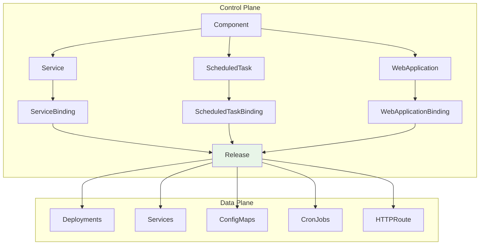
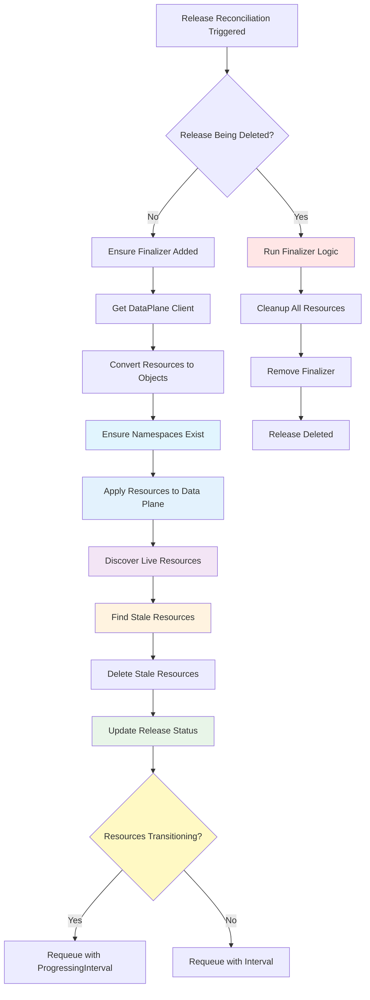

# Release CRD Design

The Release CRD serves as the deployment resource for all component types in OpenChoreo. It takes component-specific resources generated by binding controllers and applies them to data plane clusters.

## Purpose

The Release controller is responsible for deploying finalized Kubernetes resources to data plane clusters. It provides full resource lifecycle management, including creation, updates, tracking, and cleanup of resources across data plane clusters.

## Architecture Flow

The Release controller is part of OpenChoreo's multi-plane architecture, where the control plane manages developer intent and the data plane runs the actual workloads.



**Flow Explanation:**
1. **Component Definition**: Developers create Component resources that define the type and ownership of their applications
2. **Component Types**: Based on the component definition, specific component-type resources are created (Service, ScheduledTask, WebApplication)
3. **Environment Bindings**: For each target environment, binding controllers create environment-specific binding resources (ServiceBinding, ScheduledTaskBinding, WebApplicationBinding)
4. **Release Generation**: Binding controllers render complete Kubernetes manifests and create Release resources containing all the necessary deployment artifacts
5. **Data Plane Deployment**: The Release controller takes the rendered resources from Release CRDs and applies them to the target data plane clusters

## Release Controller Process

The Release controller implements a reconciliation process that ensures reliable deployment and lifecycle management of Kubernetes resources.



**Process Explanation:**

1. **Namespace Pre-creation**: Before applying any resources, the controller identifies all namespaces referenced by the resources and ensures they exist in the data plane. This prevents deployment failures due to missing namespaces.

2. **Resource Application**: The controller converts the raw resource definitions into Kubernetes objects, adds tracking labels for ownership and lifecycle management, and applies them to the target data plane cluster using server-side apply.

3. **Live Resource Discovery**: The controller queries the data plane to discover all resources currently managed by this Release. It uses GroupVersionKind (GVK) discovery to find resources across different API groups, ensuring complete inventory tracking.

4. **Stale Resource Cleanup**: The controller identifies any resources that exist in the data plane but are no longer present in the current Release specification. These orphaned resources are safely deleted to prevent resource accumulation and drift.

5. **Status Update**: Finally, the controller updates the Release status with a complete inventory of all applied resources, maintaining accurate tracking information for future reconciliation cycles and providing visibility into the deployment state.

## Key Features

### Universal Resource Support
- **Any Kubernetes Resource**: Supports deployment of any Kubernetes resource type through `runtime.RawExtension`
- **CRD Agnostic**: Automatically handles third-party CRDs (Gateway API, Cilium, etc.) without code changes
- **Future-proof**: New resource types work without controller modifications

### Resource Management
- **Inventory Tracking**: Maintains complete resource inventory in status for lifecycle management
- **Stale Resource Cleanup**: Prevents resource accumulation by cleaning up orphaned resources
- **Label-based Ownership**: Consistent resource tracking across reconciliations

### Namespace Management
- **Automatic Creation**: Pre-creates namespaces before applying resources to prevent deployment failures
- **Create-Only Pattern**: Namespaces are created but never deleted by the release controller
- **Audit Labels**: Tracks which release created each namespace for operational visibility

## CRD Structure

### ReleaseSpec

```go
type ReleaseSpec struct {
    // Owner identifies the component that owns this release
    Owner ReleaseOwner `json:"owner"`
    
    // EnvironmentName is the target environment for deployment
    EnvironmentName string `json:"environmentName"`
    
    // Resources contains the Kubernetes resources to deploy
    Resources []Resource `json:"resources,omitempty"`
    
    // Interval is the watch interval for stable resources (defaults to 5m)
    // Set to 0 to disable requeuing
    Interval *metav1.Duration `json:"interval,omitempty"`
    
    // ProgressingInterval is the watch interval for transitioning resources (defaults to 10s)
    // Set to 0 to disable requeuing
    ProgressingInterval *metav1.Duration `json:"progressingInterval,omitempty"`
}

type ReleaseOwner struct {
    // ProjectName is the project containing the component
    ProjectName string `json:"projectName"`
    
    // ComponentName is the specific component name
    ComponentName string `json:"componentName"`
}

type Resource struct {
    // ID is a unique identifier for the resource within the release
    ID string `json:"id"`
    
    // Object is the complete Kubernetes resource definition
    Object *runtime.RawExtension `json:"object"`
}
```

### ReleaseStatus

```go
type ReleaseStatus struct {
    // Resources tracks successfully applied resources
    Resources []ResourceStatus `json:"resources,omitempty"`
    
    // Conditions represent the latest available observations
    Conditions []metav1.Condition `json:"conditions,omitempty"`
}

type ResourceStatus struct {
    // ID corresponds to resource ID in spec
    ID string `json:"id"`
    
    // Group, Version, Kind identify the API details
    Group   string `json:"group"`
    Version string `json:"version"`
    Kind    string `json:"kind"`
    
    // Name and Namespace identify the resource in the data plane
    Name      string `json:"name"`
    Namespace string `json:"namespace,omitempty"`
    
    // Status captures the entire .status field of the resource applied to the data plane
    Status *runtime.RawExtension `json:"status,omitempty"`
    
    // LastObservedTime stores the last time the status was observed
    LastObservedTime *metav1.Time `json:"lastObservedTime,omitempty"`
}
```

## Controller Architecture

The Release controller implements a reconciliation process:

### Resource Application
- Converts raw resource definitions to unstructured objects
- Adds tracking labels to all resources:
  - `core.choreo.dev/managed-by`: "release-controller"
  - `core.choreo.dev/release-resource-id`: Resource ID from spec
  - `core.choreo.dev/release-uid`: Release UID for ownership tracking
  - `core.choreo.dev/release-name`: Name of the Release that manages the resource
  - `core.choreo.dev/release-namespace`: Namespace of the Release that manages the resource
- Applies resources to data plane using server-side apply

### Live Resource Discovery
- Queries data plane for all resources managed by this Release
- Uses GVK (GroupVersionKind) discovery combining:
  - Current desired resources (from spec)
  - Previously applied resources (from status)
  - Well-known Kubernetes resource types (safety net)
- Supports discovery of any CRDs without hardcoded lists

### Stale Resource Cleanup
- Identifies resources that exist in data plane but not in current spec
- Implements Flux-style inventory cleanup to prevent resource accumulation
- Deletes orphaned resources (e.g., ConfigMaps removed from spec)

### Namespace Pre-creation
- Identifies all namespaces referenced by resources before deployment
- Create namespaces with tracking labels:
  - `core.choreo.dev/created-by`: "release-controller" (audit trail)
  - `core.choreo.dev/release-name`: Name of the creating Release
  - `core.choreo.dev/release-namespace`: Namespace of the creating Release
  - `core.choreo.dev/release-uid`: UID of the creating Release
  - `core.choreo.dev/environment`: Target environment name
  - `core.choreo.dev/project`: Project name from the Release owner
- Create-only: namespaces are never deleted by release controller

### Status Update
- Updates Release status with inventory of applied resources
- Extracts and stores the `.status` field from live resources in the data plane
- Tracks `LastObservedTime` for each resource, updating only when status changes
- Maintains complete tracking for future cleanup operations

### Resource Transitioning Detection
The controller detects transitioning states to adjust reconciliation frequency:

**Transitioning Resources Check:**
- **Deployments**: Checks unavailable replicas, ready replicas, and updated replicas
- **StatefulSets**: Checks ready, available, current, and updated replicas
- **Pods**: Checks for Pending or Unknown phases
- **Other Resources**: Considered stable (ConfigMaps, Secrets, Services, etc.)

**Reconciliation Intervals:**
- **Stable Resources**: Uses `interval` field (default 5m) with 20% jitter
- **Transitioning Resources**: Uses `progressingInterval` field (default 10s) with 20% jitter
- **Jitter**: Prevents thundering herd by adding random delay to requeue intervals
- **Disable Requeue**: Set interval to 0 to disable automatic reconciliation

## Integration with Binding Controllers

The Release controller serves as the deployment target for all binding controllers.

### Binding Controller Integration

Binding controllers are expected to:
1. **Render Manifests**: Create complete Kubernetes manifests from binding + class templates
2. **Create Release**: Generate Release resources with rendered manifests
3. **Set Owner References**: Establish proper garbage collection relationships
4. **Delegate Deployment**: Let the Release controller handle all data plane interactions

## Resource Lifecycle Management

### Finalizer Handling

The Release controller implements cleanup through finalizers:

**Finalizer**: `core.choreo.dev/dataplane-cleanup`

**Finalization Process**:
1. **Status Update**: Sets "Finalizing" condition
2. **Resource Discovery**: Finds all managed resources in data plane
3. **Cleanup**: Deletes all managed resources
4. **Verification**: Retries if resources still exist (5-second intervals)
5. **Finalizer Removal**: Removes finalizer once cleanup is complete

### Resource Tracking and Cleanup

- **Proactive Cleanup**: Removes resources no longer in spec during normal reconciliation
- **Discovery**: Tracks resources across GVK changes
- **Label-based Management**: Uses consistent labeling for resource ownership
- **Graceful Deletion**: Handles resource deletion with proper verification

## Example Usage

### Basic Release Resource

```yaml
apiVersion: core.choreo.dev/v1
kind: Release
metadata:
  name: my-service-dev
  namespace: my-org
spec:
  owner:
    projectName: my-project
    componentName: my-service
  environmentName: dev
  resources:
    - id: deployment
      object:
        apiVersion: apps/v1
        kind: Deployment
        metadata:
          name: my-service
          namespace: my-org
        spec:
          replicas: 2
          selector:
            matchLabels:
              app: my-service
          template:
            metadata:
              labels:
                app: my-service
            spec:
              containers:
                - name: app
                  image: my-service:v1.0.0
                  ports:
                    - containerPort: 8080
    - id: service
      object:
        apiVersion: v1
        kind: Service
        metadata:
          name: my-service
          namespace: my-org
        spec:
          selector:
            app: my-service
          ports:
            - port: 80
              targetPort: 8080
```

### Release with Complex Resources

```yaml
apiVersion: core.choreo.dev/v1
kind: Release
metadata:
  name: my-app-prod
  namespace: my-org
spec:
  owner:
    projectName: my-project
    componentName: my-app
  environmentName: prod
  interval: 10m  # Check stable resources every 10 minutes
  progressingInterval: 5s  # Check transitioning resources every 5 seconds
  resources:
    - id: deployment
      object:
        apiVersion: apps/v1
        kind: Deployment
        # ... deployment spec
    - id: service
      object:
        apiVersion: v1
        kind: Service
        # ... service spec
    - id: hpa
      object:
        apiVersion: autoscaling/v2
        kind: HorizontalPodAutoscaler
        # ... HPA spec
    - id: pdb
      object:
        apiVersion: policy/v1
        kind: PodDisruptionBudget
        # ... PDB spec
    - id: network-policy
      object:
        apiVersion: networking.k8s.io/v1
        kind: NetworkPolicy
        # ... NetworkPolicy spec
    - id: gateway-route
      object:
        apiVersion: gateway.networking.k8s.io/v1
        kind: HTTPRoute
        # ... HTTPRoute spec
```

## Design Benefits

### Unified Deployment Model
- **Single Controller**: One controller handles all component types
- **Consistent Behavior**: Same deployment semantics across Services, ScheduledTasks, WebApplications, APIs
- **Simplified Maintenance**: Reduced code duplication and operational complexity

### Robust Resource Management
- **Complete Lifecycle**: From creation to cleanup with proper tracking
- **Leak Prevention**: Stale resource detection and cleanup
- **Multi-environment**: Supports deployment across multiple data plane clusters

### Extensibility
- **Future-proof**: Supports new resource types without code changes
- **CRD Support**: Automatically handles custom resources
- **Template Flexibility**: Supports any Kubernetes resource pattern


## Implementation Details

### Controller Location
- **Main Controller**: [`internal/controller/release/controller.go`](../../internal/controller/release/controller.go)
- **Finalization**: [`internal/controller/release/controller_finalize.go`](../../internal/controller/release/controller_finalize.go)
- **Status Tracking**: [`internal/controller/release/controller_status.go`](../../internal/controller/release/controller_status.go)
- **CRD Definition**: [`api/v1/release_types.go`](../../api/v1/release_types.go)

### Key Dependencies
- **Environment/DataPlane**: For target cluster configuration
- **Binding Controllers**: As resource providers
- **Kubernetes Client**: For data plane resource management

### Configuration
- **Finalizer**: `core.choreo.dev/dataplane-cleanup`
- **Manager Labels**: `core.choreo.dev/managed-by=release-controller`
- **Resource ID Labels**: `core.choreo.dev/release-resource-id`
- **Release UID Labels**: `core.choreo.dev/release-uid`
- **Release Name Labels**: `core.choreo.dev/release-name`
- **Release Namespace Labels**: `core.choreo.dev/release-namespace`
